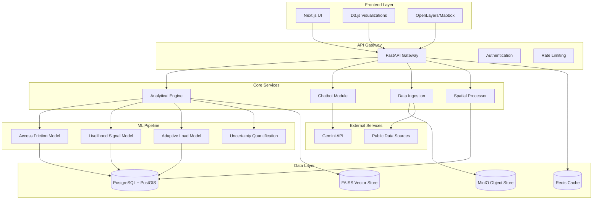

# Design Document: Urban Stress Map v2

## Overview

The Urban Stress Map v2 is an AI-powered urban diagnostic platform that quantifies integration pressure for urban migrants across three locked analytical dimensions. The system employs a microservices architecture with specialized ML models, interactive visualization components, and a comprehensive explanation layer to provide actionable insights for urban policymakers while maintaining strict ethical and privacy standards.

The platform operates exclusively on publicly available, aggregate-level data to avoid surveillance concerns while providing meaningful insights into systemic urban integration challenges. The three-axis analytical framework (Access Friction, Livelihood Signal Strength, and Adaptive Load) provides a comprehensive view of migrant integration pressure that can inform evidence-based policy decisions.

## Architecture

The system follows a layered microservices architecture designed for scalability, maintainability, and ethical data handling:



### Architectural Principles

1. **Privacy by Design**: No personally identifiable information is collected, processed, or stored
2. **Aggregate-Only Analysis**: All computations operate on population-level statistics
3. **Explainable AI**: Every prediction includes uncertainty measures and feature importance
4. **Scalable Processing**: Asynchronous batch processing with horizontal scaling capabilities
5. **Ethical Safeguards**: Built-in bias detection and non-stigmatizing language enforcement

## Components and Interfaces

### Frontend Components

#### User Interface (Next.js + Tailwind CSS)
- **Purpose**: Responsive web application providing intuitive access to analysis results
- **Key Features**: 
  - Dashboard with overview metrics and trends
  - Interactive data exploration tools
  - Export functionality for reports and visualizations
  - Multilingual support for accessibility
- **Interface**: RESTful API consumption with real-time updates via WebSocket connections

#### Visualization Engine (D3.js)
- **Purpose**: Interactive ternary plot system for three-dimensional stress visualization
- **Key Features**:
  - Ternary coordinate system with locked axes (Access Friction, Livelihood Signal, Adaptive Load)
  - Uncertainty visualization through confidence intervals and error bars
  - Interactive filtering and drill-down capabilities
  - Accessibility-compliant color schemes and alternative text
- **Interface**: SVG-based rendering with data binding to analysis results

#### Geographic Mapping (OpenLayers/Mapbox GL JS)
- **Purpose**: Spatial visualization of integration pressure patterns
- **Key Features**:
  - Choropleth mapping of stress indicators
  - Multi-scale geographic analysis (neighborhood to city-wide)
  - Overlay capabilities for demographic and infrastructure data
  - Vector tile optimization for performance
- **Interface**: GeoJSON data consumption with PostGIS spatial queries

### Backend Services

#### API Gateway (FastAPI)
- **Purpose**: Centralized request routing, authentication, and rate limiting
- **Key Features**:
  - RESTful endpoint management
  - Request validation and response formatting
  - Comprehensive API documentation with OpenAPI/Swagger
  - CORS handling for cross-origin requests
- **Interface**: HTTP/HTTPS with JSON payloads

#### Analytical Engine
- **Purpose**: Core orchestration service for ML model execution and result aggregation
- **Key Features**:
  - Model pipeline coordination
  - Result caching and optimization
  - Batch processing job management
  - Audit logging for all analysis operations
- **Interface**: Internal service communication via message queues (Celery/Redis)

#### Chatbot Module (Gemini Integration)
- **Purpose**: Natural language explanation system for analysis results
- **Key Features**:
  - Read-only access to analysis results (no score generation)
  - Multilingual explanation capabilities
  - Context-aware responses with methodology references
  - Non-stigmatizing language enforcement
- **Interface**: Gemini API integration with custom prompt engineering

#### Data Ingestion Service
- **Purpose**: Secure ingestion and validation of public datasets
- **Key Features**:
  - PII detection and rejection mechanisms
  - Data quality validation and lineage tracking
  - Format standardization and preprocessing
  - Metadata extraction and cataloging
- **Interface**: Batch processing with configurable data source connectors

#### Spatial Processing Service
- **Purpose**: Geographic analysis and spatial pattern detection
- **Key Features**:
  - PostGIS integration for spatial queries
  - Geographic clustering algorithms
  - Multi-scale aggregation capabilities
  - Spatial uncertainty quantification
- **Interface**: PostGIS database connections with GeoJSON output

### Machine Learning Pipeline

#### Access Friction Model
- **Purpose**: Quantifies procedural barriers in accessing city systems and services
- **Input Features**:
  - Service availability metrics (healthcare, education, transportation)
  - Bureaucratic complexity indicators (document requirements, processing times)
  - Language barrier measurements (multilingual service availability)
  - Digital divide indicators (online service accessibility)
- **Model Architecture**: XGBoost ensemble with feature importance tracking
- **Output**: Normalized friction score (0-1) with uncertainty bounds

#### Livelihood Signal Strength Model
- **Purpose**: Measures visibility and accessibility of economic opportunities
- **Input Features**:
  - Job posting density and accessibility
  - Skills matching indicators
  - Economic mobility pathways
  - Social network connectivity measures
- **Model Architecture**: LightGBM with BERT embeddings for text analysis
- **Output**: Normalized signal strength score (0-1) with confidence intervals

#### Adaptive Load Model
- **Purpose**: Quantifies behavioral and psychological adaptation requirements
- **Input Features**:
  - Cultural distance measurements
  - Social support system availability
  - Community integration indicators
  - Stress factor aggregations
- **Model Architecture**: Ensemble model combining structured data (XGBoost) and text embeddings (Sentence-BERT)
- **Output**: Normalized load score (0-1) with uncertainty quantification

#### Uncertainty Quantification Engine (PyMC)
- **Purpose**: Provides statistical confidence measures for all model predictions
- **Key Features**:
  - Bayesian inference for uncertainty estimation
  - Confidence interval calculation
  - Model reliability scoring
  - Sensitivity analysis for input variations
- **Output**: Uncertainty bounds, confidence levels, and reliability metrics

## Data Models

### Core Data Structures

#### Integration Pressure Record
```python
class IntegrationPressureRecord:
    id: UUID
    geographic_area: GeographicArea
    migrant_cohort: MigrantCohort
    timestamp: datetime
    access_friction: StressScore
    livelihood_signal: StressScore
    adaptive_load: StressScore
    metadata: AnalysisMetadata
```

#### Stress Score
```python
class StressScore:
    value: float  # Normalized 0-1 score
    confidence_interval: Tuple[float, float]
    uncertainty_level: float
    feature_importance: Dict[str, float]
    model_version: str
```

#### Geographic Area
```python
class GeographicArea:
    id: UUID
    name: str
    geometry: GeoJSON
    administrative_level: str  # neighborhood, district, city
    population_stats: Dict[str, Any]
    service_infrastructure: Dict[str, Any]
```

#### Migrant Cohort
```python
class MigrantCohort:
    id: UUID
    definition_criteria: Dict[str, Any]
    size_estimate: int
    demographic_profile: Dict[str, Any]
    arrival_timeframe: DateRange
    origin_regions: List[str]
```

### Database Schema

#### PostgreSQL Tables
- **integration_pressure_records**: Core analysis results with spatial indexing
- **geographic_areas**: Spatial boundaries with PostGIS geometry columns
- **migrant_cohorts**: Population group definitions and characteristics
- **data_sources**: Metadata for all ingested public datasets
- **analysis_jobs**: Batch processing job tracking and status
- **audit_logs**: Complete audit trail for all system operations

#### FAISS Vector Store
- **text_embeddings**: Sentence-BERT embeddings for textual data sources
- **similarity_indices**: Optimized indices for semantic similarity searches
- **embedding_metadata**: Mapping between embeddings and source documents

#### MinIO Object Storage
- **raw_datasets**: Original public datasets with versioning
- **processed_data**: Cleaned and standardized data files
- **model_artifacts**: Trained ML models and preprocessing pipelines
- **export_files**: Generated reports and visualization exports

## Error Handling

### Data Quality Errors
- **PII Detection**: Automatic rejection of datasets containing personally identifiable information
- **Data Validation**: Schema validation with detailed error reporting
- **Quality Thresholds**: Minimum data quality requirements with graceful degradation
- **Lineage Tracking**: Complete data provenance for debugging and auditing

### Model Prediction Errors
- **Uncertainty Thresholds**: Automatic flagging of predictions with high uncertainty
- **Feature Drift Detection**: Monitoring for changes in input data distributions
- **Model Performance Monitoring**: Continuous validation against held-out test sets
- **Graceful Degradation**: Fallback to simpler models when complex models fail

### System Integration Errors
- **API Rate Limiting**: Graceful handling of external service limitations
- **Database Connection Pooling**: Robust connection management with retry logic
- **Message Queue Reliability**: Dead letter queues for failed processing jobs
- **Cache Invalidation**: Intelligent cache management to prevent stale data

### User Experience Errors
- **Visualization Fallbacks**: Alternative representations when primary visualizations fail
- **Export Error Handling**: Robust file generation with format validation
- **Multilingual Error Messages**: Localized error messages for international users
- **Accessibility Compliance**: Error states that maintain WCAG 2.1 compliance

## Testing Strategy

The testing strategy employs a dual approach combining unit tests for specific functionality and property-based tests for universal correctness properties. This comprehensive approach ensures both concrete bug detection and general system reliability.

### Unit Testing Approach
Unit tests focus on specific examples, edge cases, and integration points:
- **Component Integration**: Testing interfaces between microservices
- **Data Validation**: Specific examples of valid and invalid data formats
- **Error Conditions**: Explicit testing of error handling pathways
- **API Endpoints**: Request/response validation for all REST endpoints
- **Visualization Rendering**: Specific test cases for chart and map generation

### Property-Based Testing Configuration
Property-based tests verify universal properties across randomized inputs using Hypothesis (Python) and fast-check (TypeScript):
- **Minimum 100 iterations** per property test to ensure comprehensive coverage
- **Custom generators** for domain-specific data types (geographic areas, migrant cohorts)
- **Shrinking strategies** to find minimal failing examples when tests fail
- **Reproducible seeds** for consistent test execution across environments

Each property-based test includes a comment tag referencing its corresponding design property:
```python
# Feature: urban-stress-map-v2, Property 1: [Property description]
```

### Testing Infrastructure
- **Continuous Integration**: Automated test execution on all code changes
- **Test Data Management**: Synthetic datasets that mirror real-world characteristics
- **Performance Testing**: Load testing for batch processing and API endpoints
- **Security Testing**: Automated scanning for common vulnerabilities
- **Accessibility Testing**: Automated WCAG 2.1 compliance validation

## Correctness Properties

*A property is a characteristic or behavior that should hold true across all valid executions of a system—essentially, a formal statement about what the system should do. Properties serve as the bridge between human-readable specifications and machine-verifiable correctness guarantees.*

### Property 1: Normalized Score Generation
*For any* valid public dataset, the Analytical Engine should generate Access Friction, Livelihood Signal Strength, and Adaptive Load scores that are all normalized to the range [0,1] with proper numerical precision.
**Validates: Requirements 1.1, 1.2, 1.3**

### Property 2: PII Detection and Rejection
*For any* dataset containing personally identifiable information, the system should detect the PII, reject the dataset, and log the incident without processing any individual-level data.
**Validates: Requirements 1.4, 4.2, 4.6**

### Property 3: Universal Uncertainty Quantification
*For any* analysis result generated by the system, the output should include uncertainty measures (confidence intervals, uncertainty levels) across all components (scores, visualizations, spatial analysis, API responses).
**Validates: Requirements 1.5, 3.3, 6.6, 7.4**

### Property 4: Aggregate-Only Analysis Enforcement
*For any* data processing operation, the system should operate exclusively on aggregate-level data without generating, storing, or processing individual-level predictions or identifiers.
**Validates: Requirements 1.6, 6.3, 8.1**

### Property 5: Chatbot Read-Only Operations
*For any* user interaction with the Chatbot Module, the system should provide explanations and responses without modifying, generating, or creating new Integration Pressure scores or analysis results.
**Validates: Requirements 2.2, 2.3**

### Property 6: Multilingual Support Consistency
*For any* supported language, the Chatbot Module and User Interface should provide consistent functionality and content translation while maintaining the same level of detail and accuracy.
**Validates: Requirements 2.4, 10.4**

### Property 7: Non-Stigmatizing Language Enforcement
*For any* text output generated by the system (chatbot responses, UI content, reports), the language should avoid stigmatizing terms when describing migrant populations and emphasize systemic rather than individual factors.
**Validates: Requirements 2.5, 8.2, 8.6**

### Property 8: Ternary Visualization Coordinate Accuracy
*For any* Integration Pressure data point, the ternary visualization should correctly position the point in three-dimensional coordinate space with Access Friction, Livelihood Signal Strength, and Adaptive Load as locked, properly labeled axes.
**Validates: Requirements 3.1, 3.2**

### Property 9: Interactive Visualization Responsiveness
*For any* user interaction with data visualizations (ternary plots, maps), the system should provide appropriate interactive responses (hover effects, click handlers, zoom functionality) while maintaining performance standards.
**Validates: Requirements 3.4, 10.2**

### Property 10: Public Data License Validation
*For any* data source submitted for ingestion, the system should verify open access licensing and accept only properly licensed public datasets while rejecting proprietary or restricted data.
**Validates: Requirements 4.1**

### Property 11: Batch Processing Scalability
*For any* large dataset submitted for processing, the system should handle it through efficient batch processing mechanisms while providing progress tracking and maintaining system performance.
**Validates: Requirements 4.3, 9.4**

### Property 12: Data Lineage Completeness
*For any* ingested dataset, the system should maintain complete lineage tracking including source information, processing steps, quality validation results, and usage in analysis operations.
**Validates: Requirements 4.4, 4.5**

### Property 13: ML Model Architecture Compliance
*For any* analysis operation, the system should use the specified ML frameworks (Sentence-BERT for NLP, XGBoost/LightGBM for structured data, PyMC for uncertainty) with separate models for each stress axis.
**Validates: Requirements 5.1, 5.2, 5.3, 5.4**

### Property 14: Model Explainability and Transparency
*For any* ML model prediction, the system should provide feature importance scores, methodology documentation, and transparent explanation of the analysis approach.
**Validates: Requirements 5.6, 8.3**

### Property 15: Spatial Analysis Multi-Scale Support
*For any* geographic analysis request, the system should support multiple scales (neighborhood, district, city-wide) while maintaining PostGIS integration and providing appropriate clustering analysis.
**Validates: Requirements 6.1, 6.4, 6.5**

### Property 16: API Response Completeness
*For any* API request, the response should include the requested data, uncertainty quantification, proper formatting (JSON/CSV/GeoJSON as specified), and comprehensive documentation references.
**Validates: Requirements 7.1, 7.3, 7.6**

### Property 17: Rate Limiting and Performance Protection
*For any* sequence of API requests, the system should enforce rate limiting to prevent overload while maintaining reasonable response times for legitimate usage patterns.
**Validates: Requirements 7.5**

### Property 18: Bias Detection and Audit Logging
*For any* analysis operation, the system should apply bias detection measures to ML models and maintain comprehensive audit logs for accountability and transparency.
**Validates: Requirements 8.4, 8.5**

### Property 19: Technology Stack Integration
*For any* system component, the implementation should correctly integrate the specified technologies (FastAPI, Celery/Redis, FAISS, MinIO, Next.js/Tailwind) while maintaining performance and reliability standards.
**Validates: Requirements 7.2, 9.1, 9.2, 9.3, 10.1**

### Property 20: Accessibility and Export Functionality
*For any* user interface element or data visualization, the system should meet WCAG 2.1 accessibility standards and provide export capabilities for reports and visualizations in standard formats.
**Validates: Requirements 3.6, 10.3, 10.6**

### Property 21: Contextual Help and User Support
*For any* complex data display or analysis result, the User Interface should provide contextual help, explanations, and guidance to support user understanding and decision-making.
**Validates: Requirements 10.5**

### Property 22: Horizontal Scaling and Caching Optimization
*For any* increased system load, the Processing System should support horizontal scaling while implementing effective caching strategies to optimize performance for repeated queries.
**Validates: Requirements 9.5, 9.6**